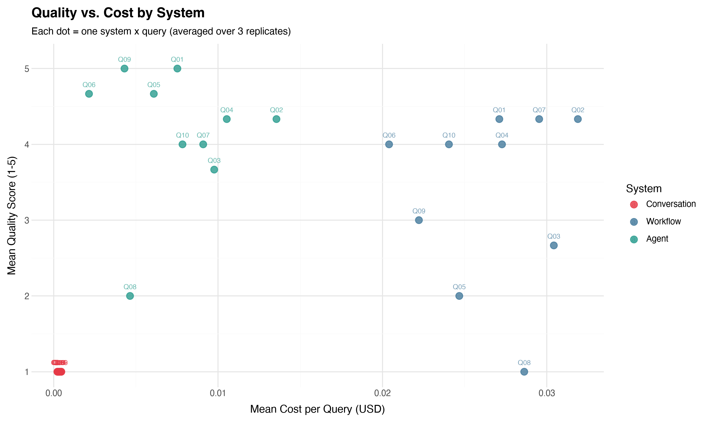

# From Chats to Workflows to Agents: Demystifying LLM Jargon by Example

**posit::conf(2026)** — Timothy Keyes, Stanford Health Care

> [Slides (PDF)](slides/) · [Synthetic data](synthetic_data/) · [Code](code/)

---

## Abstract

If the phrase "agentic AI" has ever made you scratch your head (or roll your eyes), this talk is for you. The AI field is awash in jargon that sounds precise but isn't — and when every technology is branded as an "agent" or "agentic," it's pretty hard to know what anyone is talking about. So, let's fix that.

In this gentle, no-experience-required introduction to LLM systems, I demystify the jargon by building up from first principles. Using a single running example — turning messy clinical notes into a structured summary — we walk through three levels of LLM system design: **conversations**, **workflows**, and **agents**. You'll leave with a better understanding of agentic design patterns and how to try them out for yourself.

---

## The Three Systems

The talk demonstrates three progressively more "agentic" ways to use an LLM for the same task: answering clinical questions from a patient's chart of synthetic medical notes.

### 1. Conversation (bare LLM call)

A single request/response — no notes context, no tools, no orchestration. The LLM can only rely on its training data.

```python
client = OpenAI(api_key="...", base_url="...")

response = client.responses.create(
    model=MODEL,
    input="Summarize this patient's recent history of lightheadedness.",
)

print(response.output_text)
```

The LLM has no access to patient data, so it can only produce generic or hallucinated responses.

### 2. Workflow (fixed multi-step pipeline)

A developer-controlled harness that loops over every note, summarizes each one, then combines the summaries into a final answer. The code decides what happens at each step — the LLM is just used for text generation within the developer-specified logic.

```python
client = OpenAI(...)
query = "Summarize this patient's recent history of lightheadedness."

# MAP: summarize each note
summaries = []
for note in notes:
    summary = client.responses.create(
        model=MODEL,
        instructions=f"Summarize this note for: {query}",
        input=note,
    ).output_text
    summaries.append(summary)

# REDUCE: combine into one answer
answer = client.responses.create(
    model=MODEL,
    instructions=f"Answer this query: {query}.",
    input="\n".join(summaries),
).output_text

print(answer)
```

This approach always processes every note (even irrelevant ones), which increases cost but guarantees full coverage.

### 3. Agent (LLM-driven tool loop)

The LLM itself decides which tools to call and when to stop. Given tools to list, preview, and read individual notes, it explores the chart selectively and produces a more targeted answer.

```python
client = OpenAI(...)
tools = [LIST_NOTE_TOOL, PREVIEW_NOTE_TOOL, READ_NOTE_TOOL]

history = [{"role": "user", "content": QUERY}]

while True:
    response = client.responses.create(
        model=MODEL,
        instructions=AGENT_INSTRUCTIONS,
        input=history,
        tools=tools,
    )
    tool_calls = [i for i in response.output if i.type == "function_call"]
    if not tool_calls:
        break  # LLM is done — it returned text

    history += response.output
    for tc in tool_calls:
        result = execute_tool(tc.name, tc.arguments, notes_df)
        history.append({
            "type": "function_call_output",
            "call_id": tc.call_id,
            "output": result,
        })

print(response.output_text)
```

The agent typically reads only the relevant notes, making it cheaper than the workflow while maintaining high quality.

---

## Bonus: Multi-Agent System

While the talk focused on the three systems above, this repository also includes **`example_3_multi_agent.py`** — a multi-agent architecture that goes one step further:

- **Orchestrator**: coordinates the overall process
- **Summarizer Agent**: same tool-using agent as Example 2, explores the chart and drafts a summary
- **Critic Agent**: evaluates whether the summary adequately answers the user's question based on specified criteria

The orchestrator loops: the summarizer produces a draft, the critic evaluates it, and if the critic says "refine," feedback goes back to the summarizer for another pass. This demonstrates how multiple specialized agents can collaborate, though it comes with added cost and complexity.

```bash
uv run python code/example_3_multi_agent.py
```

---

## Evaluation

To compare the three systems, we ran each one against **10 clinical queries × 3 replicates** (90 total runs) and scored each response on a 1–5 quality scale:

| Score | Meaning |
|-------|---------|
| 1 | Useless — does not address the query or contains no relevant information |
| 2 | Poor — addresses the query but is largely inaccurate or missing key information |
| 3 | Adequate — covers the main points but misses important details |
| 4 | Good — thorough and accurate, minor omissions only |
| 5 | Excellent — comprehensive, accurate, well-organized, cites specific dates/details |

### Quality vs. Cost



**Key takeaways:**

- **Conversation** (red) — cheapest but useless: with no chart access, every response scored 1.
- **Workflow** (blue) — highest cost: processes every note for every query, which adds cost without always improving quality. Performs well on holistic questions but can struggle on targeted ones.
- **Agent** (green) — best quality-to-cost ratio: selectively reads relevant notes, achieving high scores at low cost.


---

## Repository Structure

```
posit_conf_2026/
├── README.md
├── pyproject.toml                     # Python project config (uv/pip)
├── uv.lock                           # Pinned dependency versions
├── .gitignore
│
├── slides/                            # Final presentation slides (PDF)
│
├── code/
│   ├── _setup.py                      # Shared setup: LLM client, data loading, usage tracking
│   ├── example_0_conversation.py      # Example 0: bare LLM call (baseline)
│   ├── example_1_simple_workflow.py   # Example 1: fixed map-reduce workflow
│   ├── example_2_single_agent.py      # Example 2: tool-using agent
│   ├── example_3_multi_agent.py       # Bonus: orchestrator + summarizer + critic
│   ├── run_eval.py                    # Evaluation harness (3 systems × 10 queries × 3 reps)
│   ├── plot_eval.py                   # Generate the evaluation dotplot
│   ├── eval_queries.json              # The 10 evaluation queries
│   └── generate_notes.py             # Script used to generate the synthetic notes
│
├── output/
│   ├── eval_responses.csv             # Raw responses from all 90 evaluation runs
│   ├── eval_scored.csv                # Responses with quality scores (1–5)
│   └── eval_plot.png                  # The quality-vs-cost dotplot
│
└── synthetic_data/
    └── clinical_notes.json            # 30 synthetic SOAP notes for a fictional patient
```

---

## Getting Started

### Prerequisites

- **Python 3.14+**
- [**uv**](https://docs.astral.sh/uv/) (recommended) or pip
- An **OpenAI-compatible API endpoint** (the code uses a LiteLLM proxy; see `code/_setup.py` to configure your own)

### Setup

```bash
# Clone the repo
git clone https://github.com/<your-username>/posit_conf_2026.git
cd posit_conf_2026

# Create environment and install dependencies
uv sync
```

### Configuration

The code connects to an LLM via an Azure KeyVault → LiteLLM proxy setup.
Copy the example environment file and fill in your own values:

```bash
cp .env.example .env
```

Then edit `.env` with your endpoint details:

```ini
KEYVAULT_URL=https://your-keyvault.vault.azure.net
LITELLM_KEY_SECRET_NAME=YOUR-SECRET-NAME
LITELLM_BASE_URL=http://your-litellm-proxy.example.com
```

> **Note:** `.env` is gitignored and will not be committed.

### Running the Examples

```bash
# Example 0: Conversation baseline (bare LLM call, no patient data)
uv run python code/example_0_conversation.py

# Example 1: Simple workflow (map-reduce)
uv run python code/example_1_simple_workflow.py

# Example 2: Single agent with tools
uv run python code/example_2_single_agent.py

# Example 3: Multi-agent system (bonus)
uv run python code/example_3_multi_agent.py

# Custom query for any example
uv run python code/example_2_single_agent.py --query "What medications is the patient on?"
```

### Running the Evaluation

```bash
# Step 1: Run all 3 systems against 10 queries × 3 replicates
uv run python code/run_eval.py

# Step 2: Generate the evaluation plot
uv run python code/plot_eval.py
```

> **Note:** The evaluation outputs in `output/` are already committed so you can explore the results without running anything.

---

## Synthetic Data

All clinical notes in this repository are **entirely synthetic** — generated by an LLM to simulate a realistic patient chart. No real patient data was used. The fictional patient ("John TestPatient") has a 3-year medical history spanning primary care, cardiology, endocrinology, neurology, ophthalmology, and emergency medicine.

See `code/generate_notes.py` for the generation script and patient profile.

---

## About

This talk was presented at [posit::conf(2026)](https://posit.co/conference/) in Houston, TX.

**Speaker:** Timothy Keyes — Senior Data Scientist, Stanford Health Care

Questions or feedback? Feel free to open an issue or reach out.